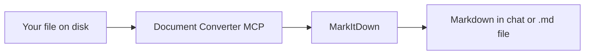

# 📄 Document Converter MCP

<p align="center">
  <strong>Convert documents to Markdown inside Cursor, VS Code, and any MCP client.</strong><br>
  Local processing · No cloud upload · Powered by <a href="https://github.com/microsoft/markitdown">MarkItDown</a>
</p>

<p align="center">
  <a href="LICENSE"></a>
  <a href="https://www.python.org/downloads/"></a>
  <a href="https://registry.modelcontextprotocol.io/v0/servers?search=io.github.Zahid-Abbas-Ali-Baig/document-converter"></a>
</p>

Give your AI assistant the ability to **read PDFs, Office files, spreadsheets, emails, audio, and more** as clean Markdown — so it can summarize, search, and reason over content instead of struggling with binary attachments.

---

## Table of contents

- [Overview 📋](#overview-)
- [Use cases 💡](#use-cases-)
- [Features ✨](#features-)
- [Supported formats 📎](#supported-formats-)
- [Quick install 🚀](#quick-install-)
  - [Before you start](#before-you-start-all-editors)
  - [Cursor 🖱️](#install-in-cursor)
  - [VS Code 💻](#install-in-vs-code)
  - [Claude Desktop 🤖](#install-in-claude-desktop)
  - [Verify it works ✅](#verify-it-works)
- [Tools 🛠️](#tools-)
- [Usage examples 💬](#usage-examples-)
- [Local development 🧪](#local-development-)
- [Configuration reference ⚙️](#configuration-reference-)
- [MCP Registry 📦](#mcp-registry-)
- [Troubleshooting 🔧](#troubleshooting-)
- [License 📜](#license-)

---

## Overview 📋

**Document Converter MCP** is a lightweight stdio server that wraps Microsoft's [MarkItDown](https://github.com/microsoft/markitdown) library for the [Model Context Protocol](https://modelcontextprotocol.io).



| | |
|---|---|
| **Registry name** | `io.github.Zahid-Abbas-Ali-Baig/document-converter` |
| **Repository** | [https://github.com/Zahid-Abbas-Ali-Baig/document-converter](https://github.com/Zahid-Abbas-Ali-Baig/document-converter) |
| **Transport** | stdio |
| **Author** | Zahid Abbas Ali Baig |
| **Dependencies** | `markitdown[pdf,docx,pptx,xlsx,xls,outlook,audio-transcription,youtube-transcription]` |

Once connected, your agent converts files locally and returns structured text — nothing is sent to a conversion API.

---

## Use cases 💡

| Scenario | What you gain |
|----------|----------------|
| **Research** | Turn PDF papers into Markdown, then ask for summaries, comparisons, or citations |
| **Documentation** | Convert `.docx` / `.pptx` drafts into `.md` beside the source for wikis or Git |
| **Product & engineering** | Preview specs and slide decks in chat before writing tickets or release notes |
| **Data & ops** | Convert Excel exports into tables the model can filter, explain, or transform |
| **Email & archives** | Extract text from `.msg` Outlook files or ZIP contents without manual copy-paste |
| **Media** | Transcribe `.mp3` / `.wav` or fetch YouTube captions into editable Markdown |

---

## Features ✨

- 🏠 **Local-first** — files stay on your machine; no third-party conversion service
- 📎 **Broad format coverage** — PDF, Office, CSV/JSON/text, Outlook `.msg`, audio, YouTube, and more (via MarkItDown)
- 🔀 **Two workflows** — save Markdown next to the source, or preview in chat only
- 📋 **Copy-paste setup** — step-by-step install for Cursor, VS Code, and Claude Desktop
- 📦 **Registry published** — listed on the [official MCP Registry](https://registry.modelcontextprotocol.io)
- ⚖️ **MIT licensed** — free for personal and commercial use

---

## Supported formats 📎

Formats below are verified against [MarkItDown](https://github.com/microsoft/markitdown) **0.1.6** with our installed extras:

`markitdown[pdf,docx,pptx,xlsx,xls,outlook,audio-transcription,youtube-transcription]`

We avoid `markitdown[all]` because it pulls Azure pre-release packages that `uv` cannot resolve with `uvx`.

### Fully supported (with this project's dependencies)

| Category | Extensions / inputs | What you get |
|----------|---------------------|--------------|
| **PDF** | `.pdf` | Text and layout extraction (`[pdf]` extra) |
| **Word** | `.docx` only | Headings, paragraphs, tables (`[docx]` — not legacy `.doc`) |
| **PowerPoint** | `.pptx` only | Slide text and structure (`[pptx]` — not legacy `.ppt`) |
| **Excel** | `.xlsx`, `.xls` | Workbook tables (`[xlsx]` / `[xls]`) |
| **Outlook** | `.msg` | Headers, body, metadata (`[outlook]`) |
| **Web** | `.html`, `.htm` | HTML → Markdown (built-in) |
| **CSV** | `.csv` | Markdown tables (built-in) |
| **Text & JSON** | `.txt`, `.md`, `.json`, `.jsonl` | Plain text / JSON content (built-in) |
| **Notebooks** | `.ipynb` | Notebook cells as Markdown (built-in) |
| **E-books** | `.epub` | Chapter HTML → Markdown (built-in) |
| **Archives** | `.zip` | Each inner file converted if its type is supported (built-in) |
| **Audio** | `.mp3`, `.wav`, `.m4a` | Metadata + speech transcription (`[audio-transcription]`) |
| **YouTube** | `https://www.youtube.com/watch?v=...` | Title, description, captions when available (`[youtube-transcription]`) |

### Limited support

| Category | Extensions | Reality |
|----------|------------|---------|
| **Images** | `.jpg`, `.jpeg`, `.png` only | EXIF metadata if `exiftool` is on your PATH; **no built-in OCR** in this MCP server (MarkItDown can describe images only when an LLM client is configured, which we do not set up) |
| **XML** | `.xml` | May work as plain text depending on file detection — not a dedicated XML parser |
| **Other URLs** | Wikipedia, RSS, Bing SERP | MarkItDown can fetch some web URLs; not tested as part of this MCP |

### Not supported

| Item | Why |
|------|-----|
| **`.eml`** | No MarkItDown converter for RFC 822 `.eml` files |
| **`.gif`, `.webp`, `.bmp`, …** | Image converter only accepts `.jpg` / `.jpeg` / `.png` |
| **Legacy Office** | `.doc`, `.ppt` — use `.docx` / `.pptx` |
| **Video files** | `.mp4` etc. — not converted as video (audio track may work in some cases via the audio converter) |
| **Azure Document Intelligence** | Needs `markitdown[az-doc-intel]` + Azure endpoint |
| **Azure Content Understanding** | Pre-release package; breaks `uvx` resolution |
| **`markitdown[all]`** | Bundles the Azure extras above |

Conversion quality depends on the source file. See the [MarkItDown documentation](https://github.com/microsoft/markitdown) for upstream details.

---

## Quick install 🚀

Follow the steps for your editor. Every config below uses the same command — only the JSON file and wrapper key differ.

### Before you start (all editors)

1. **Install [uv](https://docs.astral.sh/uv/getting-started/installation/)** (includes `uvx`).

   **Windows (PowerShell):**
   ```powershell
   powershell -ExecutionPolicy ByPass -c "irm https://astral.sh/uv/install.ps1 | iex"
   ```

   **macOS / Linux:**
   ```bash
   curl -LsSf https://astral.sh/uv/install.sh | sh
   ```

2. **Verify `uvx` works** (open a **new** terminal after installing):

   ```bash
   uvx --version
   ```

3. **Optional — test the server** (it will sit idle with no output; that is normal for stdio MCP):

   ```bash
   uvx --from git+https://github.com/Zahid-Abbas-Ali-Baig/document-converter --with markitdown[pdf,docx,pptx,xlsx,xls,outlook,audio-transcription,youtube-transcription] document-converter-mcp
   ```

   Press `Ctrl+C` to stop.

---

<a id="install-in-cursor"></a>

### Install in Cursor 🖱️

1. Open **Cursor → Settings → MCP** (or edit your config file directly).
2. **Config file location:**
   - **Windows:** `%USERPROFILE%\.cursor\mcp.json`
   - **macOS:** `~/.cursor/mcp.json`
   - **Linux:** `~/.cursor/mcp.json`
   - **Project-only:** `.cursor/mcp.json` in your project folder
3. Add or merge this block inside `mcpServers` (copy the whole JSON):

```json
{
  "mcpServers": {
    "document-converter": {
      "command": "uvx",
      "args": [
        "--from",
        "git+https://github.com/Zahid-Abbas-Ali-Baig/document-converter",
        "--with",
        "markitdown[pdf,docx,pptx,xlsx,xls,outlook,audio-transcription,youtube-transcription]",
        "document-converter-mcp"
      ]
    }
  }
}
```

4. **Save** the file and **restart Cursor** (or click **Reload** next to MCP in settings).
5. **Check:** Settings → MCP → `document-converter` should show **enabled** (green). Tools: `convert_to_markdown`, `preview_markdown`.

<details>
<summary>Cursor one-click install (optional — if manual JSON fails, use this)</summary>

1. Open this link in your browser: [**Add to Cursor**](https://cursor.com/en/install-mcp?name=document-converter&config=eyJjb21tYW5kIjoidXZ4IiwiYXJncyI6WyItLWZyb20iLCJnaXQraHR0cHM6Ly9naXRodWIuY29tL1phaGlkLUFiYmFzLUFsaS1CYWlnL2RvY3VtZW50LWNvbnZlcnRlciIsIi0td2l0aCIsIm1hcmtpdGRvd25bcGRmLGRvY3gscHB0eCx4bHN4LHhscyxvdXRsb29rLGF1ZGlvLXRyYW5zY3JpcHRpb24seW91dHViZS10cmFuc2NyaXB0aW9uXSIsImRvY3VtZW50LWNvbnZlcnRlci1tY3AiXX0%3D)
2. Or paste into the browser address bar:

```
cursor://anysphere.cursor-deeplink/mcp/install?name=document-converter&config=eyJjb21tYW5kIjoidXZ4IiwiYXJncyI6WyItLWZyb20iLCJnaXQraHR0cHM6Ly9naXRodWIuY29tL1phaGlkLUFiYmFzLUFsaS1CYWlnL2RvY3VtZW50LWNvbnZlcnRlciIsIi0td2l0aCIsIm1hcmtpdGRvd25bcGRmLGRvY3gscHB0eCx4bHN4LHhscyxvdXRsb29rLGF1ZGlvLXRyYW5zY3JpcHRpb24seW91dHViZS10cmFuc2NyaXB0aW9uXSIsImRvY3VtZW50LWNvbnZlcnRlci1tY3AiXX0%3D
```

3. Click **Install** in Cursor, then restart if tools do not appear.

</details>

---

<a id="install-in-vs-code"></a>

### Install in VS Code 💻

Requires **VS Code 1.102+** with [built-in MCP support](https://code.visualstudio.com/docs/copilot/customization/mcp-servers).

> **Do not paste `vscode://mcp/install?...` anywhere.** That link is broken in VS Code and creates servers like `my-mcp-server-*` with `spawn vscode://... ENOENT`. Use the JSON below.

#### Method A — Copy-paste user config (recommended)

1. **Ctrl+Shift+P** → **MCP: Open User Configuration**
2. **Delete** any broken servers where `"command"` starts with `vscode://` (e.g. `my-mcp-server-15e7e771`).
3. **Replace** the file contents with (or merge `servers` into your existing file):

```json
{
  "servers": {
    "document-converter": {
      "type": "stdio",
      "command": "uvx",
      "args": [
        "--from",
        "git+https://github.com/Zahid-Abbas-Ali-Baig/document-converter",
        "--with",
        "markitdown[pdf,docx,pptx,xlsx,xls,outlook,audio-transcription,youtube-transcription]",
        "document-converter-mcp"
      ]
    }
  }
}
```

4. **Save**, then **Ctrl+Shift+P** → **MCP: List Servers** → start **document-converter**.

**If you get `uvx` not found (`ENOENT`):** run `where uvx` (Windows) or `which uvx` (macOS/Linux) and set `"command"` to the full path:

```json
"command": "C:\\Users\\YOUR_USER\\.local\\bin\\uvx.exe"
```

#### Method B — Open this repo in VS Code

1. `git clone https://github.com/Zahid-Abbas-Ali-Baig/document-converter.git`
2. **File → Open Folder** → select `document-converter`
3. VS Code loads [`.vscode/mcp.json`](.vscode/mcp.json) automatically
4. **Ctrl+Shift+P** → **MCP: List Servers** → start **document-converter**

#### Method C — Add Server wizard

**Ctrl+Shift+P** → **MCP: Add Server** → choose **stdio**, then enter:

| Field | Value |
|-------|-------|
| **Command** | `uvx` |
| **Arg 1** | `--from` |
| **Arg 2** | `git+https://github.com/Zahid-Abbas-Ali-Baig/document-converter` |
| **Arg 3** | `--with` |
| **Arg 4** | `markitdown[pdf,docx,pptx,xlsx,xls,outlook,audio-transcription,youtube-transcription]` |
| **Arg 5** | `document-converter-mcp` |

---

<a id="install-in-claude-desktop"></a>

### Install in Claude Desktop 🤖

1. Open Claude Desktop config:
   - **Windows:** `%APPDATA%\Claude\claude_desktop_config.json`
   - **macOS:** `~/Library/Application Support/Claude/claude_desktop_config.json`
2. Add inside `mcpServers`:

```json
{
  "mcpServers": {
    "document-converter": {
      "command": "uvx",
      "args": [
        "--from",
        "git+https://github.com/Zahid-Abbas-Ali-Baig/document-converter",
        "--with",
        "markitdown[pdf,docx,pptx,xlsx,xls,outlook,audio-transcription,youtube-transcription]",
        "document-converter-mcp"
      ]
    }
  }
}
```

3. **Restart Claude Desktop**.

---

<a id="verify-it-works"></a>

### Verify it works ✅

Ask your AI assistant:

```
List the tools from document-converter MCP.
```

Or:

```
Preview markdown for a PDF on my machine at C:\path\to\file.pdf
```

You should see `convert_to_markdown` and `preview_markdown` being called.

---

## Tools 🛠️

| Tool | Description | Writes to disk |
|------|-------------|----------------|
| `convert_to_markdown` | Converts a file or URL to Markdown and saves output (`.md` beside source, or `youtube-{id}.md` for YouTube URLs) | Yes |
| `preview_markdown` | Returns Markdown in the chat response only | No |

**Input:** absolute or relative path to a file on your machine (or a supported URL for YouTube).

**Output:** Markdown text suitable for summarization, diffing, or committing to Git.

---

## Usage examples 💬

Natural-language prompts you can paste into Cursor, VS Code, or Claude Desktop after the MCP server is connected.

### Convert a PDF and summarize

**Prompt:**

```
Use document-converter to convert C:\Reports\annual-report.pdf to markdown,
then give me a 5-bullet executive summary.
```

**What happens:** The agent calls `convert_to_markdown`, creates `annual-report.md` next to the PDF, and summarizes the result.

---

### Preview a Word doc before saving

**Prompt:**

```
Preview markdown for ./contracts/vendor-agreement.docx without saving.
Tell me if there is a termination clause.
```

**What happens:** The agent calls `preview_markdown`, reads the content in chat, and answers your question — no file is written.

---

### Excel to analysis

**Prompt:**

```
Convert D:\data\sales-q1.xlsx to markdown and list the top 3 products by revenue.
```

**What happens:** Spreadsheet tables become Markdown the model can parse and rank.

---

### PowerPoint for release notes

**Prompt:**

```
Preview ./slides/product-launch.pptx as markdown and draft release notes
from the slide titles and bullet points.
```

---

### Outlook email extraction

**Prompt:**

```
Convert C:\Mail\customer-escalation.msg to markdown and extract action items.
```

---

### Batch-style workflow (multiple files)

**Prompt:**

```
Convert these to markdown and save beside each file:
- C:\Docs\spec-v2.pdf
- C:\Docs\api-reference.docx
- C:\Docs\metrics.xlsx
Then confirm the .md paths.
```

---

### Audio transcription

**Prompt:**

```
Preview markdown for ./recordings/standup-notes.mp3 and list decisions made.
```

*Requires the `audio-transcription` extra (included in this project's dependencies).*

---

### YouTube URL

**Prompt (preview in chat):**

```
Use preview_markdown on https://www.youtube.com/watch?v=EXAMPLE and summarize the main points.
```

**Prompt (save to file):**

```
Use convert_to_markdown on https://www.youtube.com/watch?v=EXAMPLE
```

**What happens:** MarkItDown fetches the watch page, extracts title/description/metadata, and appends captions via `youtube-transcript-api` when available. `convert_to_markdown` saves `youtube-EXAMPLE.md` in the server working directory.

*Use `https://www.youtube.com/watch?v=...` format. Requires the `youtube-transcription` extra and an internet connection.*

---

### Example Markdown output (PDF)

*Illustrative snippet after conversion:*

```markdown
# Quarterly Results

Revenue increased 12% year over year driven by enterprise subscriptions.

## Highlights

- Net retention: 118%
- New logos: 240
- Gross margin: 74%
```

Quality depends on the source document layout and MarkItDown version.

---

## Local development 🧪

Clone if you prefer a local virtual environment over `uvx`.

```bash
git clone https://github.com/Zahid-Abbas-Ali-Baig/document-converter.git
cd document-converter
python -m venv .venv
```

**Windows (PowerShell):**

```powershell
.venv\Scripts\activate
pip install -r requirements.txt
```

**macOS / Linux:**

```bash
source .venv/bin/activate
pip install -r requirements.txt
```

Run the server directly (stdio — used by MCP clients):

```bash
python server.py
```

---

## Configuration reference ⚙️

All clients run the same underlying command (full JSON examples are in [Quick install 🚀](#quick-install-) — not repeated here):

| Part | Value |
|------|-------|
| **Command** | `uvx` |
| **Arg 1** | `--from` |
| **Arg 2** | `git+https://github.com/Zahid-Abbas-Ali-Baig/document-converter` |
| **Arg 3** | `--with` |
| **Arg 4** | `markitdown[pdf,docx,pptx,xlsx,xls,outlook,audio-transcription,youtube-transcription]` |
| **Arg 5** | `document-converter-mcp` |

### Config file locations

| Client | File | JSON root key |
|--------|------|----------------|
| **Cursor** | `%USERPROFILE%\.cursor\mcp.json` or `.cursor/mcp.json` | `mcpServers` |
| **VS Code** | User MCP config or `.vscode/mcp.json` | `servers` (+ `"type": "stdio"`) |
| **Claude Desktop** | `claude_desktop_config.json` | `mcpServers` |

Copy-paste configs: [Quick install 🚀](#quick-install-).

<a id="local-clone-no-uvx"></a>

### Local clone (no `uvx`)

Clone and install — see [Local development 🧪](#local-development-). Then point your MCP client at the venv Python:

**Windows:**

```json
{
  "mcpServers": {
    "document-converter": {
      "command": "REPO_PATH\\.venv\\Scripts\\python.exe",
      "args": ["REPO_PATH\\server.py"]
    }
  }
}
```

**macOS / Linux:**

```json
{
  "mcpServers": {
    "document-converter": {
      "command": "REPO_PATH/.venv/bin/python",
      "args": ["REPO_PATH/server.py"]
    }
  }
}
```

---

## MCP Registry 📦

Listed on the [official MCP Registry](https://registry.modelcontextprotocol.io) as:

**`io.github.Zahid-Abbas-Ali-Baig/document-converter`**

> This is a **registry identifier**, not a browser URL. Do not open `http://io.github.Zahid-Abbas-Ali-Baig/document-converter` — it will not load. Use the links below instead.

- 🌐 [Browse MCP Registry](https://registry.modelcontextprotocol.io)
- 🔍 [Search this server](https://registry.modelcontextprotocol.io/v0/servers?search=io.github.Zahid-Abbas-Ali-Baig/document-converter)
- 📂 [GitHub repository](https://github.com/Zahid-Abbas-Ali-Baig/document-converter)
- 📥 [GitHub Release v1.0.0](https://github.com/Zahid-Abbas-Ali-Baig/document-converter/releases/tag/v1.0.0) (`.mcpb` bundle)

---

## Troubleshooting 🔧

### Dependency resolution / `markitdown[all]` errors

If you see errors about `azure-ai-contentunderstanding` or pre-releases, remove `markitdown[all]` from your config. Use:

```
markitdown[pdf,docx,pptx,xlsx,xls,outlook,audio-transcription,youtube-transcription]
```

### VS Code: `spawn vscode://mcp/install?... ENOENT`

VS Code's install link wrote the **URL as the command** instead of `uvx`. Fix:

1. **MCP: Open User Configuration** (or `.vscode/mcp.json` in this repo)
2. **Delete** entries like `my-mcp-server-*` where `"command"` starts with `vscode://`
3. Use [`.vscode/mcp.json`](.vscode/mcp.json) from this repo, or the JSON in [Install in VS Code 💻](#install-in-vs-code)
4. **MCP: List Servers** → restart **document-converter**

**Do not use the README `vscode://mcp/install?...` link** — it is unreliable in VS Code.

### `Failed to acquire MessagePort`

This comes from **Cursor or VS Code**, not this server:

```
[MCPService] Error creating client: Failed to acquire MessagePort ...
```

| Step | Action |
|------|--------|
| 1 | **Fully quit** the editor, then reopen |
| 2 | Install **[uv](https://docs.astral.sh/uv/)** for `uvx` installs |
| 3 | Test: `uvx --from git+https://github.com/Zahid-Abbas-Ali-Baig/document-converter --with markitdown[pdf,docx,pptx,xlsx,xls,outlook,audio-transcription,youtube-transcription] document-converter-mcp` (idle = normal for stdio) |
| 4 | Use [Local clone (no `uvx`)](#local-clone-no-uvx) if `uvx` fails |
| 5 | **Settings → MCP** → remove and re-add the server |
| 6 | Update Cursor/VS Code to the latest version |

**Reliable fallback:** follow [Local development 🧪](#local-development-) and use the [local clone MCP config](#local-clone-no-uvx).

### Install button does nothing (Cursor on Windows)

Use the copy-paste JSON in [Install in Cursor 🖱️](#install-in-cursor) instead of the install badge.

### Tools not visible

Reload MCP or restart the editor. Confirm the server is **enabled** (not red/disabled).

---

## License 📜

MIT License — see [LICENSE](LICENSE).

Copyright (c) 2026 Zahid Abbas Ali Baig
