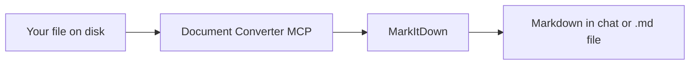

# Document Converter MCP

<p align="center">
  <strong>Convert documents to Markdown inside Cursor, VS Code, and any MCP client.</strong><br>
  Local processing · No cloud upload · Powered by <a href="https://github.com/microsoft/markitdown">MarkItDown</a>
</p>

<p align="center">
  <a href="LICENSE"></a>
  <a href="https://www.python.org/downloads/"></a>
  <a href="https://registry.modelcontextprotocol.io/v0/servers?search=io.github.Zahid-Abbas-Ali-Baig/document-converter"></a>
</p>

Give your AI assistant the ability to **read PDFs, Office files, spreadsheets, emails, audio, and more** as clean Markdown — so it can summarize, search, and reason over content instead of struggling with binary attachments.

---

## Table of contents

- [Overview](#overview)
- [Use cases](#use-cases)
- [Features](#features)
- [Supported formats](#supported-formats)
- [Quick install](#quick-install)
- [Tools](#tools)
- [Usage examples](#usage-examples)
- [Manual installation](#manual-installation)
- [Configuration](#configuration)
- [MCP Registry](#mcp-registry)
- [Troubleshooting](#troubleshooting)
- [License](#license)

---

## Overview

**Document Converter MCP** is a lightweight stdio server that wraps Microsoft's [MarkItDown](https://github.com/microsoft/markitdown) library for the [Model Context Protocol](https://modelcontextprotocol.io).



| | |
|---|---|
| **Registry name** | `io.github.Zahid-Abbas-Ali-Baig/document-converter` |
| **Repository** | [https://github.com/Zahid-Abbas-Ali-Baig/document-converter](https://github.com/Zahid-Abbas-Ali-Baig/document-converter) |
| **Transport** | stdio |
| **Author** | Zahid Abbas Ali Baig |
| **Dependencies** | `markitdown[pdf,docx,pptx,xlsx,xls,outlook,audio-transcription,youtube-transcription]` |

Once connected, your agent converts files locally and returns structured text — nothing is sent to a conversion API.

---

## Use cases

| Scenario | What you gain |
|----------|----------------|
| **Research** | Turn PDF papers into Markdown, then ask for summaries, comparisons, or citations |
| **Documentation** | Convert `.docx` / `.pptx` drafts into `.md` beside the source for wikis or Git |
| **Product & engineering** | Preview specs and slide decks in chat before writing tickets or release notes |
| **Data & ops** | Convert Excel exports into tables the model can filter, explain, or transform |
| **Email & archives** | Extract text from `.msg` / `.eml` or ZIP contents without manual copy-paste |
| **Media** | Transcribe `.mp3` / `.wav` or fetch YouTube captions into editable Markdown |

---

## Features

- **Local-first** — files stay on your machine; no third-party conversion service
- **Broad format coverage** — PDF, Office, email, web, data, images, audio, and more
- **Two workflows** — save Markdown next to the source, or preview in chat only
- **One-click install** — deeplinks for Cursor and VS Code
- **Registry published** — listed on the [official MCP Registry](https://registry.modelcontextprotocol.io)
- **MIT licensed** — free for personal and commercial use

---

## Supported formats

This project installs **`markitdown[pdf,docx,pptx,xlsx,xls,outlook,audio-transcription,youtube-transcription]`** — the widest MarkItDown extras set that installs cleanly with `uvx`. We avoid `markitdown[all]` because it pulls Azure pre-release packages that `uv` cannot resolve by default.

| Category | Extensions / inputs | Notes |
|----------|---------------------|-------|
| **PDF** | `.pdf` | Text extraction via MarkItDown PDF handler |
| **Word** | `.docx` | Headings, paragraphs, tables |
| **PowerPoint** | `.pptx` | Slide text and structure |
| **Excel** | `.xlsx`, `.xls` | Modern and legacy workbooks |
| **Outlook** | `.msg` | Email body and metadata |
| **Web** | `.html`, `.htm` | Static HTML pages |
| **Data & text** | `.csv`, `.json`, `.xml`, `.txt`, `.md` | Structured and plain text |
| **Images** | `.png`, `.jpg`, `.jpeg`, `.gif`, `.webp` | EXIF metadata; OCR when supported |
| **Archives** | `.zip` | Processes supported files inside the archive |
| **E-books** | `.epub` | Chapter text extraction |
| **Email** | `.eml` | RFC 822 messages |
| **Audio** | `.mp3`, `.wav` | Speech transcription (optional extra) |
| **YouTube** | URL | Fetches video transcription (optional extra) |

### Not included (requires Azure or pre-release deps)

| Feature | Why |
|---------|-----|
| Azure Document Intelligence | Needs `markitdown[az-doc-intel]` + Azure endpoint |
| Azure Content Understanding | Pre-release package; breaks `uvx` resolution |
| `markitdown[all]` | Bundles the Azure extras above |

For the latest upstream behavior, see the [MarkItDown documentation](https://github.com/microsoft/markitdown).

---

## Quick install

**Requirement:** [uv](https://docs.astral.sh/uv/getting-started/installation/) (`uvx` included). See [manual setup](#configuration) if buttons do not work.

### Cursor

**Option 1 — Install link (try this first)**

1. [**Add to Cursor**](https://cursor.com/en/install-mcp?name=document-converter&config=eyJjb21tYW5kIjoidXZ4IiwiYXJncyI6WyItLWZyb20iLCJnaXQraHR0cHM6Ly9naXRodWIuY29tL1phaGlkLUFiYmFzLUFsaS1CYWlnL2RvY3VtZW50LWNvbnZlcnRlciIsIi0td2l0aCIsIm1hcmtpdGRvd25bcGRmLGRvY3gscHB0eCx4bHN4LHhscyxvdXRsb29rLGF1ZGlvLXRyYW5zY3JpcHRpb24seW91dHViZS10cmFuc2NyaXB0aW9uXSIsImRvY3VtZW50LWNvbnZlcnRlci1tY3AiXX0%3D) — open this link (not the badge image alone)
2. If Cursor does not open, copy the [deeplink](#cursor-deeplink-fallback) into your **browser address bar**
3. Click **Install** when prompted
4. Open **Cursor Settings → MCP** and confirm `document-converter` is enabled
5. **Reload MCP** or restart Cursor if tools do not appear

[](https://cursor.com/en/install-mcp?name=document-converter&config=eyJjb21tYW5kIjoidXZ4IiwiYXJncyI6WyItLWZyb20iLCJnaXQraHR0cHM6Ly9naXRodWIuY29tL1phaGlkLUFiYmFzLUFsaS1CYWlnL2RvY3VtZW50LWNvbnZlcnRlciIsIi0td2l0aCIsIm1hcmtpdGRvd25bcGRmLGRvY3gscHB0eCx4bHN4LHhscyxvdXRsb29rLGF1ZGlvLXRyYW5zY3JpcHRpb24seW91dHViZS10cmFuc2NyaXB0aW9uXSIsImRvY3VtZW50LWNvbnZlcnRlci1tY3AiXX0%3D)
[](https://cursor.com/en/install-mcp?name=document-converter&config=eyJjb21tYW5kIjoidXZ4IiwiYXJncyI6WyItLWZyb20iLCJnaXQraHR0cHM6Ly9naXRodWIuY29tL1phaGlkLUFiYmFzLUFsaS1CYWlnL2RvY3VtZW50LWNvbnZlcnRlciIsIi0td2l0aCIsIm1hcmtpdGRvd25bcGRmLGRvY3gscHB0eCx4bHN4LHhscyxvdXRsb29rLGF1ZGlvLXRyYW5zY3JpcHRpb24seW91dHViZS10cmFuc2NyaXB0aW9uXSIsImRvY3VtZW50LWNvbnZlcnRlci1tY3AiXX0%3D)

<a id="cursor-deeplink-fallback"></a>

**Option 2 — Deeplink fallback** (Windows: paste into Chrome/Edge address bar):

```
cursor://anysphere.cursor-deeplink/mcp/install?name=document-converter&config=eyJjb21tYW5kIjoidXZ4IiwiYXJncyI6WyItLWZyb20iLCJnaXQraHR0cHM6Ly9naXRodWIuY29tL1phaGlkLUFiYmFzLUFsaS1CYWlnL2RvY3VtZW50LWNvbnZlcnRlciIsIi0td2l0aCIsIm1hcmtpdGRvd25bcGRmLGRvY3gscHB0eCx4bHN4LHhscyxvdXRsb29rLGF1ZGlvLXRyYW5zY3JpcHRpb24seW91dHViZS10cmFuc2NyaXB0aW9uXSIsImRvY3VtZW50LWNvbnZlcnRlci1tY3AiXX0%3D
```

**Option 3 — Manual (always works)**

1. Open **Cursor → Settings → MCP → Add new MCP server**
2. Paste into user or project `mcp.json`:

```json
{
  "mcpServers": {
    "document-converter": {
      "command": "uvx",
      "args": [
        "--from",
        "git+https://github.com/Zahid-Abbas-Ali-Baig/document-converter",
        "--with",
        "markitdown[pdf,docx,pptx,xlsx,xls,outlook,audio-transcription,youtube-transcription]",
        "document-converter-mcp"
      ]
    }
  }
}
```

**Button does nothing?** On Windows, badge clicks often open the image URL without launching Cursor. Use the [**Add to Cursor**](https://cursor.com/en/install-mcp?name=document-converter&config=eyJjb21tYW5kIjoidXZ4IiwiYXJncyI6WyItLWZyb20iLCJnaXQraHR0cHM6Ly9naXRodWIuY29tL1phaGlkLUFiYmFzLUFsaS1CYWlnL2RvY3VtZW50LWNvbnZlcnRlciIsIi0td2l0aCIsIm1hcmtpdGRvd25bcGRmLGRvY3gscHB0eCx4bHN4LHhscyxvdXRsb29rLGF1ZGlvLXRyYW5zY3JpcHRpb24seW91dHViZS10cmFuc2NyaXB0aW9uXSIsImRvY3VtZW50LWNvbnZlcnRlci1tY3AiXX0%3D) text link, the deeplink, or manual JSON.

### VS Code

Requires **VS Code 1.102 or newer** — MCP is [built into VS Code](https://code.visualstudio.com/docs/copilot/customization/mcp-servers). There is **no separate MCP extension** to install.

**Do not paste the `vscode://mcp/install?...` link as the server command.** That URL is only for one-click install in a browser. VS Code needs a real executable (`uvx`) in `mcp.json`.

#### Option 1 — Manual config (recommended on Windows)

1. **Command Palette** (`Ctrl+Shift+P`) → **MCP: Open User Configuration**
2. Replace or add this (use your full `uvx` path if `uvx` is not on PATH — run `where uvx` in a terminal):

```json
{
  "servers": {
    "document-converter": {
      "type": "stdio",
      "command": "uvx",
      "args": [
        "--from",
        "git+https://github.com/Zahid-Abbas-Ali-Baig/document-converter",
        "--with",
        "markitdown[pdf,docx,pptx,xlsx,xls,outlook,audio-transcription,youtube-transcription]",
        "document-converter-mcp"
      ]
    }
  }
}
```

3. **MCP: List Servers** → start **document-converter** (or restart VS Code)

**Windows example** if `uvx` is not found (`ENOENT`):

```json
"command": "C:\\Users\\YOUR_USER\\.local\\bin\\uvx.exe"
```

#### Option 2 — Add Server wizard

**Command Palette** → **MCP: Add Server** → **stdio** → command `uvx` → add each arg on a separate line (do not paste the `vscode://` link).

#### Option 3 — Install link

Open this in your **browser** (not in the command field):

```
vscode://mcp/install?%7B%22name%22%3A%22document-converter%22%2C%22type%22%3A%22stdio%22%2C%22command%22%3A%22uvx%22%2C%22args%22%3A%5B%22--from%22%2C%22git%2Bhttps%3A//github.com/Zahid-Abbas-Ali-Baig/document-converter%22%2C%22--with%22%2C%22markitdown%5Bpdf%2Cdocx%2Cpptx%2Cxlsx%2Cxls%2Coutlook%2Caudio-transcription%2Cyoutube-transcription%5D%22%2C%22document-converter-mcp%22%5D%7D
```

Docs: [Add and manage MCP servers](https://code.visualstudio.com/docs/copilot/customization/mcp-servers)

---

## Tools

| Tool | Description | Writes to disk |
|------|-------------|----------------|
| `convert_to_markdown` | Converts a file or URL to Markdown and saves output (`.md` beside source, or `youtube-{id}.md` for YouTube URLs) | Yes |
| `preview_markdown` | Returns Markdown in the chat response only | No |

**Input:** absolute or relative path to a file on your machine (or a supported URL for YouTube).

**Output:** Markdown text suitable for summarization, diffing, or committing to Git.

---

## Usage examples

Natural-language prompts you can paste into Cursor, VS Code, or Claude Desktop after the MCP server is connected.

### Convert a PDF and summarize

**Prompt:**

```
Use document-converter to convert C:\Reports\annual-report.pdf to markdown,
then give me a 5-bullet executive summary.
```

**What happens:** The agent calls `convert_to_markdown`, creates `annual-report.md` next to the PDF, and summarizes the result.

---

### Preview a Word doc before saving

**Prompt:**

```
Preview markdown for ./contracts/vendor-agreement.docx without saving.
Tell me if there is a termination clause.
```

**What happens:** The agent calls `preview_markdown`, reads the content in chat, and answers your question — no file is written.

---

### Excel to analysis

**Prompt:**

```
Convert D:\data\sales-q1.xlsx to markdown and list the top 3 products by revenue.
```

**What happens:** Spreadsheet tables become Markdown the model can parse and rank.

---

### PowerPoint for release notes

**Prompt:**

```
Preview ./slides/product-launch.pptx as markdown and draft release notes
from the slide titles and bullet points.
```

---

### Outlook email extraction

**Prompt:**

```
Convert C:\Mail\customer-escalation.msg to markdown and extract action items.
```

---

### Batch-style workflow (multiple files)

**Prompt:**

```
Convert these to markdown and save beside each file:
- C:\Docs\spec-v2.pdf
- C:\Docs\api-reference.docx
- C:\Docs\metrics.xlsx
Then confirm the .md paths.
```

---

### Audio transcription

**Prompt:**

```
Preview markdown for ./recordings/standup-notes.mp3 and list decisions made.
```

*Requires the `audio-transcription` extra (included in this project's dependencies).*

---

### YouTube URL

**Prompt (preview in chat):**

```
Use preview_markdown on https://www.youtube.com/watch?v=EXAMPLE and summarize the main points.
```

**Prompt (save to file):**

```
Use convert_to_markdown on https://www.youtube.com/watch?v=EXAMPLE
```

**What happens:** MarkItDown fetches the watch page, extracts title/description/metadata, and appends captions via `youtube-transcript-api` when available. `convert_to_markdown` saves `youtube-EXAMPLE.md` in the server working directory.

*Use `https://www.youtube.com/watch?v=...` format. Requires the `youtube-transcription` extra and an internet connection.*

---

### Example Markdown output (PDF)

*Illustrative snippet after conversion:*

```markdown
# Quarterly Results

Revenue increased 12% year over year driven by enterprise subscriptions.

## Highlights

- Net retention: 118%
- New logos: 240
- Gross margin: 74%
```

Quality depends on the source document layout and MarkItDown version.

---

## Manual installation

Clone the repository if you prefer a local virtual environment over `uvx`.

```bash
git clone https://github.com/Zahid-Abbas-Ali-Baig/document-converter.git
cd document-converter
python -m venv .venv
```

**Windows (PowerShell):**

```powershell
.venv\Scripts\activate
pip install -r requirements.txt
```

**macOS / Linux:**

```bash
source .venv/bin/activate
pip install -r requirements.txt
```

Run the server directly (stdio — used by MCP clients):

```bash
python server.py
```

---

## Configuration

### Option A — `uvx` (recommended)

No clone required; works on Windows, macOS, and Linux:

```json
{
  "mcpServers": {
    "document-converter": {
      "command": "uvx",
      "args": [
        "--from",
        "git+https://github.com/Zahid-Abbas-Ali-Baig/document-converter",
        "--with",
        "markitdown[pdf,docx,pptx,xlsx,xls,outlook,audio-transcription,youtube-transcription]",
        "document-converter-mcp"
      ]
    }
  }
}
```

### Option B — local clone

Replace `REPO_PATH` with the absolute path to your clone.

**Windows:**

```json
{
  "mcpServers": {
    "document-converter": {
      "command": "REPO_PATH\\.venv\\Scripts\\python.exe",
      "args": ["REPO_PATH\\server.py"]
    }
  }
}
```

**macOS / Linux:**

```json
{
  "mcpServers": {
    "document-converter": {
      "command": "REPO_PATH/.venv/bin/python",
      "args": ["REPO_PATH/server.py"]
    }
  }
}
```

| Client | Config location |
|--------|-----------------|
| Cursor | `.cursor/mcp.json` (project) or user MCP settings |
| VS Code | User `mcp.json` or `.vscode/mcp.json` ([docs](https://code.visualstudio.com/docs/copilot/customization/mcp-servers)) |
| Claude Desktop | `claude_desktop_config.json` |

---

## MCP Registry

Listed on the [official MCP Registry](https://registry.modelcontextprotocol.io) as:

**`io.github.Zahid-Abbas-Ali-Baig/document-converter`**

- [Search registry](https://registry.modelcontextprotocol.io/v0/servers?search=io.github.Zahid-Abbas-Ali-Baig/document-converter)
- [GitHub Release v1.0.0](https://github.com/Zahid-Abbas-Ali-Baig/document-converter/releases/tag/v1.0.0) (`.mcpb` bundle)

---

## Troubleshooting

### Dependency resolution / `markitdown[all]` errors

If you see errors about `azure-ai-contentunderstanding` or pre-releases, remove `markitdown[all]` from your config. Use:

```
markitdown[pdf,docx,pptx,xlsx,xls,outlook,audio-transcription,youtube-transcription]
```

### VS Code: `spawn vscode://mcp/install?... ENOENT`

VS Code tried to run the **install link** as the server command. Fix:

1. **MCP: Open User Configuration**
2. Remove any server whose `command` starts with `vscode://`
3. Use the `servers` + `uvx` JSON from [VS Code install](#vs-code) above
4. **MCP: List Servers** → restart the server

### `Failed to acquire MessagePort`

This comes from **Cursor or VS Code**, not this server:

```
[MCPService] Error creating client: Failed to acquire MessagePort ...
```

| Step | Action |
|------|--------|
| 1 | **Fully quit** the editor, then reopen |
| 2 | Install **[uv](https://docs.astral.sh/uv/)** for `uvx` installs |
| 3 | Test: `uvx --from git+https://github.com/Zahid-Abbas-Ali-Baig/document-converter --with markitdown[pdf,docx,pptx,xlsx,xls,outlook,audio-transcription,youtube-transcription] document-converter-mcp` (idle = normal for stdio) |
| 4 | Use [Option B — local clone](#option-b--local-clone) if `uvx` fails |
| 5 | **Settings → MCP** → remove and re-add the server |
| 6 | Update Cursor/VS Code to the latest version |

**Reliable colleague setup (clone + venv):**

```bash
git clone https://github.com/Zahid-Abbas-Ali-Baig/document-converter.git
cd document-converter
python -m venv .venv
.venv\Scripts\activate          # Windows
pip install -r requirements.txt
```

```json
{
  "mcpServers": {
    "document-converter": {
      "command": "C:\\path\\to\\document-converter\\.venv\\Scripts\\python.exe",
      "args": ["C:\\path\\to\\document-converter\\server.py"]
    }
  }
}
```

### Install button does nothing (Windows)

Use [**Add to Cursor**](https://cursor.com/en/install-mcp?name=document-converter&config=eyJjb21tYW5kIjoidXZ4IiwiYXJncyI6WyItLWZyb20iLCJnaXQraHR0cHM6Ly9naXRodWIuY29tL1phaGlkLUFiYmFzLUFsaS1CYWlnL2RvY3VtZW50LWNvbnZlcnRlciIsIi0td2l0aCIsIm1hcmtpdGRvd25bcGRmLGRvY3gscHB0eCx4bHN4LHhscyxvdXRsb29rLGF1ZGlvLXRyYW5zY3JpcHRpb24seW91dHViZS10cmFuc2NyaXB0aW9uXSIsImRvY3VtZW50LWNvbnZlcnRlci1tY3AiXX0%3D), the [deeplink](#cursor-deeplink-fallback), or manual JSON.

### Tools not visible

Reload MCP or restart the editor. Confirm the server is **enabled** (not red/disabled).

---

## License

MIT License — see [LICENSE](LICENSE).

Copyright (c) 2026 Zahid Abbas Ali Baig
